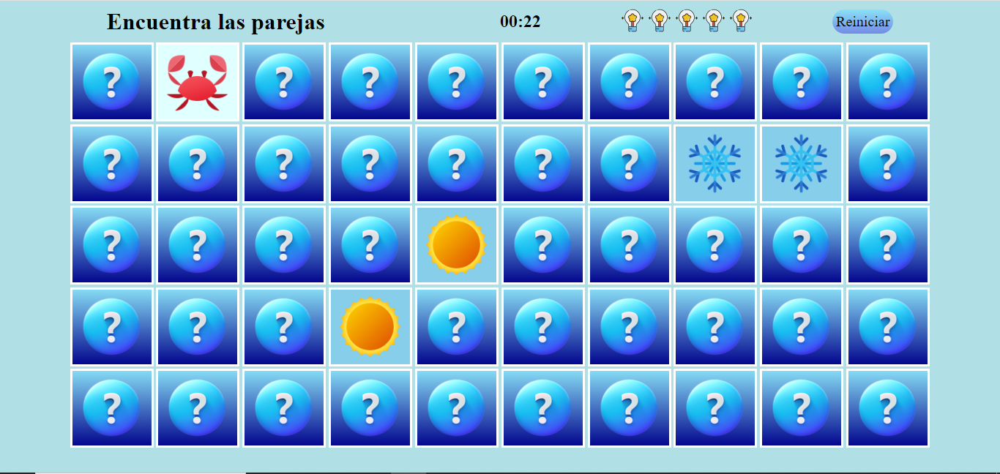

# Encuentras las parejas

  

  
  
  

## Descripción
¡Bienvenido al juego de Encuentra las Parejas! Este divertido juego de memoria te desafiará a encontrar todas las cartas iguales en el menor tiempo posible. Pon a prueba tu memoria y habilidades de concentración mientras intentas emparejar todas las cartas en el tablero. ¡Diviértete y desafía a tus amigos a superar tus mejores tiempos! ¿Estás listo para aceptar el desafío?

[Jugar🎮](https://obregon-jose.github.io/encuentra-las-parejas/)
